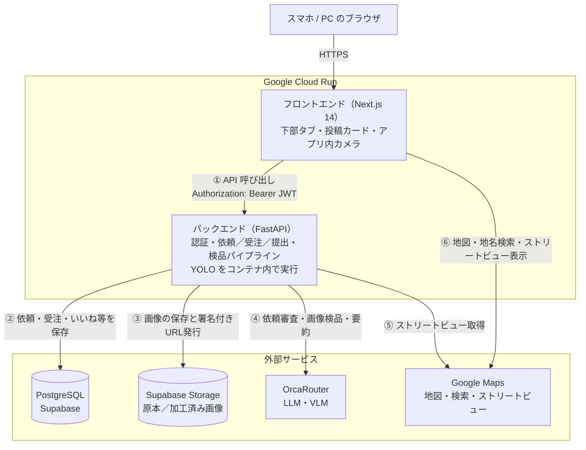
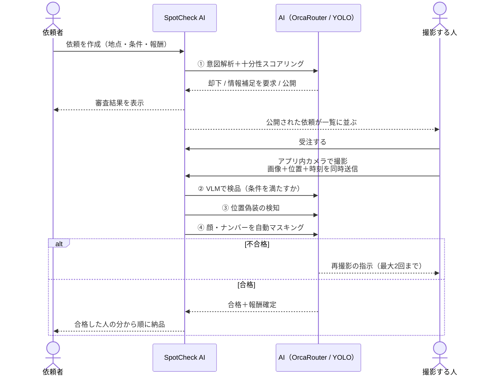
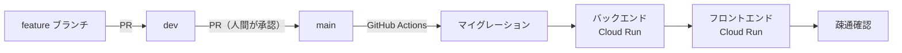
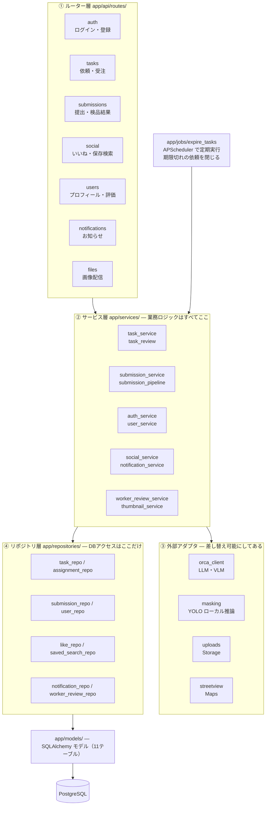
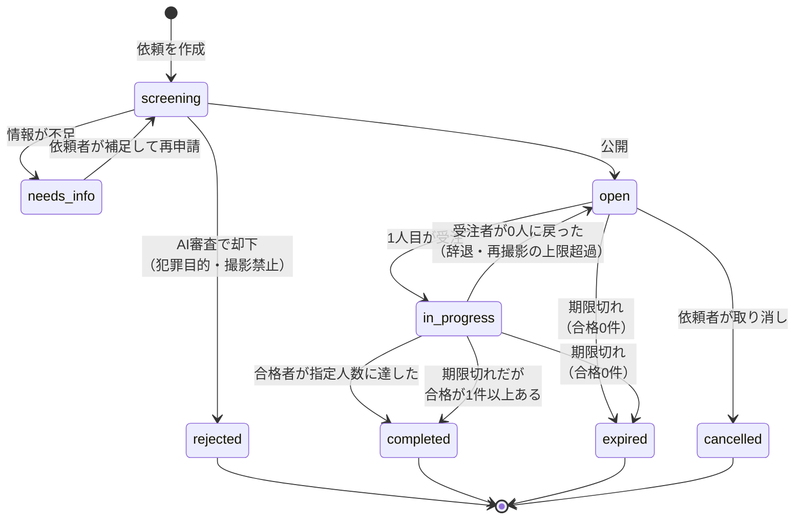
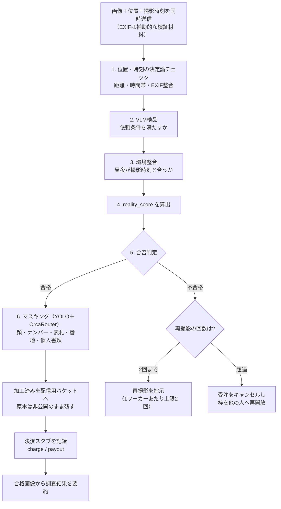
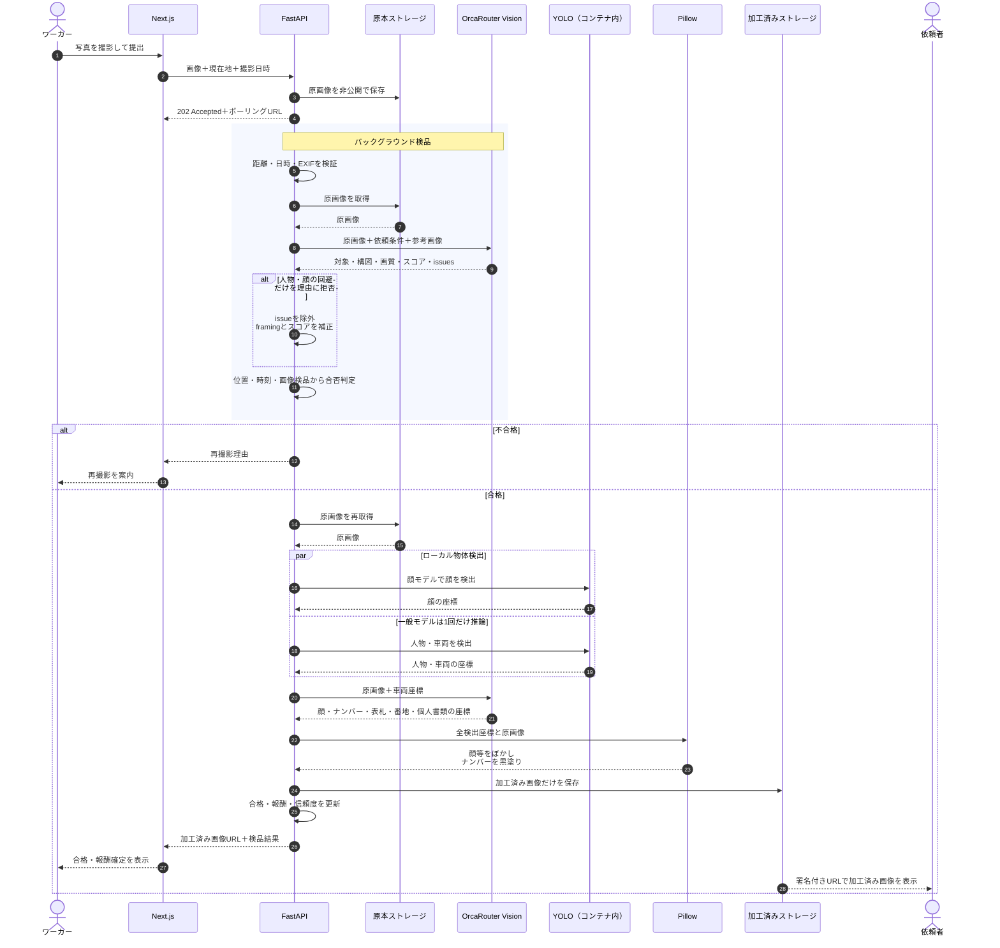
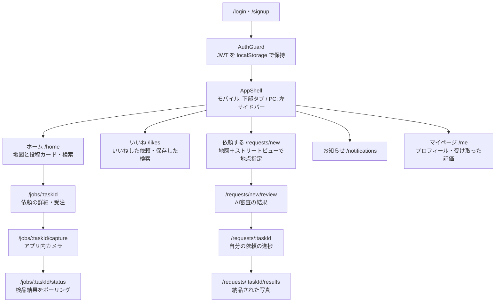

# SpotCheck AI

遠隔地の現況確認（不動産管理・広告監査・工事進捗確認など）を依頼したいクライアントと、
現地にいるワーカーをマッチングするプラットフォーム。

**人間による目視検品を一切排除**し、以下をAIが一貫して自動処理する。

1. 依頼テキストの意図解析（犯罪目的・撮影禁止場所のブロック）
2. 依頼情報の十分性スコアリング（不足なら補足を要求）
3. 提出画像のVLM検品（条件を満たすかの判定と再撮影指示）
4. 位置偽装（Spoofing）検知
5. 顔・ナンバープレート・表札の自動マスキング

仕様は `spotcheck-ai/CLAUDE.md` と `spotcheck-ai/docs/` にある。実装はそちらを正とする。

---

## 構成

アプリ一式は `spotcheck-ai/` 配下にあります。以下は同ディレクトリからの相対パスです。

| ディレクトリ | 内容 |
|---|---|
| `spotcheck-ai/backend/` | FastAPI（Python 3.11+）。API・AI連携・検品パイプライン |
| `spotcheck-ai/frontend/` | Next.js 14（App Router / TypeScript / Tailwind）。画面①〜⑩ |
| `spotcheck-ai/docs/` | 設計ドキュメント（アーキテクチャ・DB・API・AI・画面・フェーズ） |
| `spotcheck-ai/deploy/` | Cloud Run へのデプロイ設定 |
| `spotcheck-ai/docker-compose.yml` | ローカル開発用の PostgreSQL（任意） |

**以降のコマンドは、断りがなければ `spotcheck-ai/` の中で実行します。**

```bash
cd spotcheck-ai
```

---

## 全体像（アーキテクチャ）

GitHub 上ではそのまま図として表示されます。



| # | 何をしているか |
|---|---|
| ① | 全APIリクエストに `Authorization: Bearer <JWT>` を付ける。**ロールは無く、1アカウントで「依頼する」「撮影する」の両方**ができる |
| ② | 依頼・受注・提出・いいね・保存検索を保存。ローカル開発は docker の PostgreSQL、本番は Supabase |
| ③ | 提出画像の**原本は非公開**で保管し、マスキング済み画像とサムネイルを別バケットへ。配信は署名付きURL |
| ④ | 依頼審査（テキスト）・画像検品（VLM）・結果要約。**呼び出しは必ず `OrcaClient` 経由**にする |
| ⑤ | 写真が無い依頼のサムネイルを作るため、サーバーから Street View Static を叩く |
| ⑥ | ブラウザ側の地図表示・地名検索・ストリートビュー。キーが無い場合は緯度経度の手入力へフォールバック |

> 顔・人物・車両はバックエンドのコンテナ内でYOLOを推論し、OrcaRouter Visionが
> 顔の見逃しとナンバープレート・表札・番地・個人書類を補完します。

### 依頼から納品までの流れ



**人間の目視検品は一切入りません。** 合否はすべてAIが判定し、合格した人から逐次納品されます
（全員の完了を待ちません）。

### キーが無くても動きます

| 機能 | キー無し | キーあり |
|---|---|---|
| 画面・依頼・受注・提出の一連の流れ | ✅ 動く | ✅ 動く |
| AI審査・画像検品 | 固定応答（スタブ） | OrcaRouter で実推論 |
| 画像の保存 | ローカルディスク | Supabase Storage |
| 地図・地名検索・ストリートビュー | 緯度経度の手入力 | Google Maps |
| 投稿サムネイル | サーバー生成のプレースホルダ | ストリートビュー / AI生成画像 |
| 顔・ナンバーのマスキング | 重みがあれば動く | 同じ（ローカル推論のため） |

### 本番（Cloud Run）

| サービス | URL |
|---|---|
| フロントエンド | **https://spotcheck-frontend-dathtekrwq-an.a.run.app** |
| バックエンド | https://spotcheck-backend-dathtekrwq-an.a.run.app |


スマホのカメラでこのQRコードを読み取ると、そのまま開けます。
ログインは `yamada` / `spotcheck123`（他に `demo_company` `sato` `suzuki`）。

HTTPSで配信されるため、**スマホからカメラと現在地取得も使えます**。
自分の依頼は自分で受注できないため、依頼〜受注を通して見る場合は2アカウントを使ってください。

**このURLで動いているのは `main` ブランチです。** `main` にマージすると GitHub Actions が
自動でデプロイするため、`main` と本番は常に一致します。



`dev` の変更はまだ本番に出ていません。出すには `dev` → `main` の PR をマージします。
デプロイ手順は `spotcheck-ai/docs/07-deployment.md` を参照。
QRコードを作り直すときは `./backend/.venv/bin/python deploy/make_qr.py <URL>`。

---

## 内部構造（コードの地図）

**どのファイルを触ればいいか**を最初に掴むための図。`dev` ブランチの現状に対応しています。

### バックエンドの層構造

**上から下へ一方向にしか呼びません。** 下の層が上の層を呼ぶことはありません。



| 層 | 役割 | やってはいけないこと |
|---|---|---|
| ① ルーター | HTTPの入出力だけ。認証済みユーザーを受け取り、サービスへ渡す | 業務判断を書く／DBを直接触る |
| ② サービス | 業務ロジックと権限判定（依頼のオーナーか受注者か） | SQLを直接書く |
| ③ 外部アダプタ | AI・ストレージ・地図との通信を閉じ込める | 呼び出し側にレスポンス形式を漏らす |
| ④ リポジトリ | DBアクセスの集約 | 業務判断を書く |

> **AI呼び出しは必ず `orca_client` 経由**にしています。OrcaRouter の仕様が変わっても、
> 直すのは `orca_client.py` の中だけで済むようにするためです（`CLAUDE.md` D-04）。

### 依頼のステータス遷移



| 遷移 | どこで起きるか |
|---|---|
| `screening` の分岐 | `task_review.review_task` — AIの意図解析＋十分性スコアリング |
| `open` → `in_progress` | `task_service.accept_task` — **1人目の受注で切り替わる**（定員を待たない） |
| `in_progress` → `open` | `task_service.reopen_if_slot_available` — 有効な受注が0件になり、かつ期限内のとき |
| `in_progress` → `completed` | `submission_pipeline` — 合格者数が `required_worker_count` に達したとき |
| 期限切れの処理 | `jobs/expire_tasks` — **合格が1件でもあれば `completed`**、0件なら `expired` |
| 取り消し | `task_service.cancel_task` — `screening` / `needs_info` / `open` のときだけ可能 |

### 画像検品パイプライン（提出1件あたり）

`submission_pipeline.run_validation` が `BackgroundTasks` で走ります。
**APIは即座に `202 Accepted` を返し、フロントは結果をポーリング**します。



**検品と報酬はワーカー単位**です。合格した人から順に納品・報酬確定し、全員の完了を待ちません。

### 画像検品・マスキング処理のシーケンス

人物や顔の写り込み自体は検品の不合格理由にしません。OrcaRouterが人物の回避だけを理由に
不合格を返した場合はバックエンドで補正し、通常の合格処理とマスキングへ進めます。
対象物が写っていない、暗くて判別できない、強くぶれている、位置・時刻が一致しない場合は
従来どおり再撮影になります。



| マスキング対象 | 検出 | 加工 |
|---|---|---|
| 顔 | YOLO顔モデル＋OrcaRouter補完 | ぼかし |
| ナンバープレート | OrcaRouter Vision | 黒塗り |
| 表札・番地・部屋番号 | OrcaRouter Vision | ぼかし |
| 個人情報が写った書類・伝票 | OrcaRouter Vision | ぼかし |

人物全体は検出件数のみ記録し、工事や混雑状況の確認に必要なため全身はぼかしません。
一般YOLOの推論結果は1回だけ取得し、人物と車両へ振り分けています。

### フロントエンドの画面構成

ログイン後は**全ユーザー共通**の画面です。ロールはありません。



| 場所 | 役割 |
|---|---|
| `src/app/` | 画面。状態を持つものだけ `"use client"` |
| `src/components/` | `layout` `task` `map` `capture` `auth` `ui` に分かれる |
| `src/lib/api/` | **API呼び出しはここに集約**。コンポーネントから `fetch` を直接書かない |
| `src/lib/polling.ts` | 検品結果の段階的バックオフ（2秒→5秒→15秒→30秒、上限15分） |
| `src/types/api.ts` | バックエンドのスキーマに対応する型 |

---

## 費用が出ないようにしている設定

デモURLを共有すると、アクセス数に応じて課金される可能性があります。以下を入れて上限を作っています。

| 対策 | 内容 |
|---|---|
| **APIキーの分離** | ブラウザ用（リファラー制限あり）とサーバー用（Street View Static のみ）を別キーにした |
| **リファラー制限** | ブラウザ用キーは `spotcheck-frontend-dathtekrwq-an.a.run.app/*` と `localhost:3000/*` のみ許可。キーを抜き取られても他サイトからは使えない |
| **APIの絞り込み** | ブラウザ用キーは Maps JavaScript / Geocoding / Places (New) / Street View のみ。Routes・Weather 等は外した |
| **1日あたりの上限** | Geocoding・Places・Street View Static を各1,000回／日、Maps JavaScript を3,000回／日に制限。超えると課金されず単にエラーになる |
| **最大インスタンス数** | Cloud Run はバックエンド3・フロント5まで。大量アクセス時も費用が跳ねない |
| **予算アラート** | 請求先アカウントに $10 の予算を作成し、50% / 90% / 100% でメール通知 |

> **キーはブラウザに露出します**（`NEXT_PUBLIC_*` はJSに埋め込まれるため原理的に隠せません）。
> だからこそリファラー制限とAPIの絞り込み、1日上限が防御線になります。
> URLを共有する相手が増えるときは、上限値を見直してください。

無料枠の目安は Cloud Run が月200万リクエスト、Maps はSKUごとに月1万回程度です。
新規アカウントの $300 クレジット（90日）があれば、デモ規模で自己負担が出ることはほぼありません。

---

## APIキーの扱い（最初に読んでください）

**APIキーはリポジトリで共有しません。各自が自分のキーを用意するか、キー無しで動かします。**

- `backend/.env` と `frontend/.env.local` は **`.gitignore` 済み**。コミットされません
- リポジトリに入っているのは**値が空の雛形**（`.env.example` / `.env.local.example`）だけです
- **キーが1つも無くても、全画面が動きます。** AIは固定応答（スタブ）、画像はローカル保存、
  地図は緯度経度の手入力にフォールバックします。まずはこの状態で立ち上げてください

| ファイル | Git | 中身 | 用意する人 |
|---|---|---|---|
| `backend/.env.example` | ✅ コミット | 雛形（値は空） | — |
| `backend/.env` | ❌ 無視 | 実際の値 | 各自 |
| `frontend/.env.local.example` | ✅ コミット | 雛形（値は空） | — |
| `frontend/.env.local` | ❌ 無視 | 実際の値 | 各自 |

> `git add -f` を使わない限り `.env` が誤ってコミットされることはありません。
> 念のため `git status --porcelain` の出力に `.env` が現れないことを確認してから push してください。

---

## セットアップ（キー無しで動かす / 所要5分）

### 1. データベース

```bash
cd spotcheck-ai                  # 未移動ならここで移動する
docker compose up -d db          # localhost:5432 に PostgreSQL が起動する
```

Mac を再起動したら再度実行してください（自動起動しません）。

### 2. バックエンド

```bash
cd backend
python3 -m venv .venv
./.venv/bin/pip install -e ".[dev]"
cp .env.example .env             # そのままでOK。値は埋めなくても起動する
./.venv/bin/alembic upgrade head
./.venv/bin/python -m scripts.seed_demo_users
./.venv/bin/python -m scripts.seed_demo_tasks   # 一覧確認用の投稿（任意）
./.venv/bin/uvicorn app.main:app --reload --port 8000
```

`GET http://localhost:8000/api/health` が 200 を返せば起動できています。
不足している環境変数は起動ログに警告として出ます（**警告が出ていても動きます**）。

### 3. フロントエンド

別のターミナルで:

```bash
cd frontend
npm install
cp .env.local.example .env.local # そのままでOK
npm run dev                      # http://localhost:3000
```

### 4. 起動確認

```bash
docker ps --filter name=spotcheck-db --format '{{.Names}} {{.Status}}'
curl -s -o /dev/null -w "backend  %{http_code}\n" http://localhost:8000/api/health
curl -s -o /dev/null -w "frontend %{http_code}\n" http://localhost:3000/
```

`healthy` / `200` / `200` なら完了です。`http://localhost:3000` を開くとログイン画面が出ます。

### 5. ログイン

`scripts.seed_demo_users` で投入されるアカウントを使います（パスワードは全員 `spotcheck123`）。

| ログインID | 表示名 |
|---|---|
| `demo_company` | デモ株式会社 |
| `yamada` | 山田 太郎 |
| `sato` | 佐藤 花子 |
| `suzuki` | 鈴木 一郎 |

画面右上の「新規登録」から自分のアカウントを作ることもできます。
**ロールはありません**。どのアカウントでも「依頼する」と「撮影する」の両方ができます
（ただし自分が出した依頼は自分で受注できません。動作確認には2アカウント使ってください）。

パスワードを変えたい場合は `DEMO_USER_PASSWORD=好きなパスワード ./.venv/bin/python -m scripts.seed_demo_users`。

### 一覧を賑やかす（任意）

```bash
cd backend
./.venv/bin/python -m scripts.seed_demo_tasks        # 募集中の投稿5件（SOLD / HOT / NEW が1つずつ出る）
./.venv/bin/python -m scripts.regenerate_thumbnails --force  # サムネイルの作り直し
```

いずれも固定UUIDなので、何度実行しても同じ投稿になります。

---

## 追加設定（各自のキーを入れて機能を有効化する）

どれも**任意**です。入れなくてもデモは通ります。

| 入れる変数 | 有効になるもの | 未設定時の挙動 |
|---|---|---|
| `ORCA_API_KEY`（backend） | 実際のAI審査・画像検品 | 固定応答のスタブ（デモは通る） |
| `SUPABASE_URL` + `SUPABASE_SECRET_KEY`（backend） | Supabase Storage への画像保存 | ローカル保存（`LOCAL_STORAGE_DIR`） |
| `NEXT_PUBLIC_GOOGLE_MAPS_API_KEY`（frontend） | 地図表示・場所検索・住所の自動取得 | 緯度経度の手入力フォーム |
| `JWT_SECRET`（backend） | 本番相当のトークン署名 | 開発用の固定鍵（誰でも偽造できる） |
| `GOOGLE_MAPS_SERVER_API_KEY`（backend） | 写真なし依頼のサムネイルにストリートビューを使う | サーバーが描くプレースホルダ画像 |
| `ORCA_ROUTER_IMAGE`（backend） | サムネイルのAI画像生成 | ストリートビュー画像かプレースホルダ |
| `DATABASE_URL`（backend） | 別のDBを使う | docker-compose のローカルDB |

### AI（OrcaRouter）

`backend/.env` の `ORCA_API_KEY` に自分のキーを設定し、`ORCA_STUB_MODE=false` にします。
`.py` を1つ触るか uvicorn を再起動すると反映されます（**`.env` の変更は自動反映されません**）。

> 実測レイテンシは依頼審査 20〜90秒、画像検品 30秒〜15分です。画面⑦のポーリングは
> 仕様どおり60秒で打ち切るため、**デモを通す場合は `ORCA_STUB_MODE=true` を推奨**します。

### Supabase Storage

`SUPABASE_URL` と `SUPABASE_SECRET_KEY`（Dashboard → Settings → API Keys の `sb_secret_...`）を
設定し、初回のみバケットを作成します。

```bash
cd backend && ./.venv/bin/python -m scripts.init_storage
```

`submissions-raw`（原本）と `submissions-processed`（マスキング済み）を**非公開**で作成します。
原本はクライアントに一切返しません。`SUPABASE_SECRET_KEY` は**サーバー専用**で、
`NEXT_PUBLIC_` を付けたりフロントに置いたりしないでください。

### Google Maps

**最短（課金設定なし）**: [Maps Demo Key](https://developers.google.com/maps/documentation/javascript/demo-key)
で「Get a Demo Key」を押すとその場でキーが出ます。プロトタイピング専用・日次クォータあり。

**通常**: [Google Cloud Console](https://console.cloud.google.com/) でプロジェクトを作り、
請求先アカウントを紐付けて次の2つを有効化 → 「認証情報」でAPIキーを作成。

- **Maps JavaScript API**（地図本体）
- **Geocoding API**（ピンを置いた時の住所自動取得と、地名・住所のテキスト検索）
- **Places API (New)**（任意。検索ボックスの候補表示。無効でも Geocoding のテキスト検索で動きます）
- **Street View Static API**（任意。写真なし依頼のサムネイル生成に使用。サーバー側キーへ設定）

> **地名検索が動かない場合**は、この2点がほぼ原因です。
> ① プロジェクトで**課金（Billing）が有効化されていない** ② **Geocoding API が未有効**。
> Demo Key は Maps JavaScript API だけが使えるため、地図は出ても検索は `REQUEST_DENIED` になります。
> 画面には Google が返した理由をそのまま日本語で表示します。

取得したキーを `frontend/.env.local` の `NEXT_PUBLIC_GOOGLE_MAPS_API_KEY` に設定します。
`next dev` が `.env.local` を自動リロードするので、ブラウザを Cmd+Shift+R で再読み込みしてください。

> `NEXT_PUBLIC_` の値は**ブラウザに露出します**。キーの編集画面で必ず制限してください。
> アプリケーションの制限 → HTTPリファラー `http://localhost:3000/*` /
> APIの制限 → `Maps JavaScript API` / `Geocoding API`（＋使う場合は `Places API`）のみ。

うまく表示されないときはブラウザのコンソール（F12）にGoogleのエラー名が出ます。

| エラー | 原因 |
|---|---|
| `InvalidKeyMapError` | キー文字列の誤り（前後の空白・改行） |
| `ApiNotActivatedMapError` | Maps JavaScript API が未有効 |
| `BillingNotEnabledMapError` | 請求先アカウント未設定（→ Demo Key を使う） |
| `RefererNotAllowedMapError` | リファラー制限に**いま開いているURL**が無い（例: `3100` 番で動かしているのに `http://localhost:3000/*` しか許可していない） |

> 「**このページでは Google マップが正しく読み込まれませんでした**」という灰色の表示が出た場合は、
> 上のいずれかです。ブラウザのコンソール（F12）に上の名前が出ているので、それで切り分けてください。
> アプリ側は認証失敗を検知して**日本語の対処案内と緯度経度の手入力**に切り替えるため、
> 地図が使えなくても依頼の作成は続けられます。

キーが不正でもアプリは落ちず、手入力フォームへ自動フォールバックします。

### マスキング用の重み

顔・車両検出はローカル推論です。重みが無い場合はマスキングをスキップして警告を出します
（画像は配信されます）。

```bash
cd backend/models_weights
curl -sLO https://github.com/ultralytics/assets/releases/download/v8.3.0/yolov8n.pt
curl -sL -o yolov8n-face.pt https://huggingface.co/arnabdhar/YOLOv8-Face-Detection/resolve/main/model.pt
```

`yolov8n-face.pt` は公式配布ではありません（第三者のHugging Faceリポジトリ）。
ライセンスを確認のうえ利用してください。重みは `.gitignore` 済みでコミットされません。

---

## `git pull` した後にやること

| 変わっていたら | 実行するコマンド |
|---|---|
| `backend/pyproject.toml` | `cd backend && ./.venv/bin/pip install -e ".[dev]"` |
| `backend/alembic/versions/` にファイル追加 | `cd backend && ./.venv/bin/alembic upgrade head` |
| `frontend/package.json` | `cd frontend && npm install` |
| `.py` / `.tsx` のみ | 何もしなくてよい（`--reload` / `next dev` が自動反映） |

迷ったら次を実行しても壊れません（すべて冪等）。

```bash
(cd backend && ./.venv/bin/pip install -q -e ".[dev]" && ./.venv/bin/alembic upgrade head && ./.venv/bin/pytest -q)
(cd frontend && npm install && npx tsc --noEmit)
```

---

## 開発コマンド

```bash
# バックエンド
cd backend && ./.venv/bin/pytest              # テスト
cd backend && ./.venv/bin/ruff check .        # Lint
cd backend && ./.venv/bin/alembic revision --autogenerate -m "message"

# フロントエンド
cd frontend && npm run lint
cd frontend && npx tsc --noEmit
cd frontend && npm run build
```

テストは `spotcheck_test` データベースを自動作成し、マイグレーションを適用して実行する。
ストレージはローカル、AIはスタブへ固定されるため、外部サービスへは接続しない。

### スタブモード

`ORCA_STUB_MODE=true`（または `ORCA_API_KEY` 未設定）で、AIを固定応答に切り替える。

| 用途 | スタブの応答 |
|---|---|
| 依頼審査 | `approved` / スコア85 |
| 画像検品 | 奇数回目は45点で不合格（`TOO_DARK`）、偶数回目は88点で合格 |

画像検品を交互に失敗させるのは、**デモで再撮影ループを見せるため**。
デモ当日の障害対策としてこのモードは維持する。

---

## デモシナリオ

`http://localhost:3000` を開き、トップでユーザーを選ぶ。

1. **デモ株式会社**（クライアント）で「駅前の再開発工事の進捗確認」を作成
   → AI審査でスコアが出て公開される
2. 参考に「隣の家に人がいるか確認してほしい」を作成
   → **AIが却下する**（安全性のアピール）
3. 情報不足の依頼（「写真撮ってきて」だけ）を作成
   → **AIが補足要求を出す** → その場で補足して再審査 → 公開
4. ヘッダー右上から **山田 太郎**（ワーカー）へ切替 → 地図/リストで依頼を発見 → 受注
5. カメラで撮影（GPS取得済バッジとタイムスタンプが出ている状態）→ 提出
6. **1回目は不合格 → 再撮影指示が具体的に表示される** → 再撮影して合格
7. **顔とナンバープレートがマスクされた画像**が生成される
8. クライアントに切替 → 結果画面で AI要約・Reality Score・ワーカー評価を確認

> 画面⑥のカメラは HTTPS が必要（`localhost` は例外）。スマートフォンで試す場合は
> `npx next dev --experimental-https` かトンネル経由で開く。
> カメラが使えない環境ではファイル選択にフォールバックする。

---

## 実装状況

| Phase | 内容 | 状態 |
|---|---|---|
| 0 | 環境構築 | 完了 |
| 1 | DB＋CRUD API（AIはスタブ） | 完了 |
| 2 | 画面①〜⑩の一気通貫 | 完了 |
| 3 | 依頼審査AI | 完了 |
| 4 | 画像検品AI＋位置偽装対策 | 完了 |
| 5 | プライバシー自動マスキング | 完了 |
| 6 | 仕上げ（期限ジョブ・決済スタブ・エラー処理） | 完了 |

未検証のまま残っている点は `spotcheck-ai/docs/06-phases.md` と各フェーズのコミットメッセージに記載。

- スマートフォン実機（HTTPS）でのカメラ・GPS動作
- Google Maps API キーを設定した状態での地図描画
