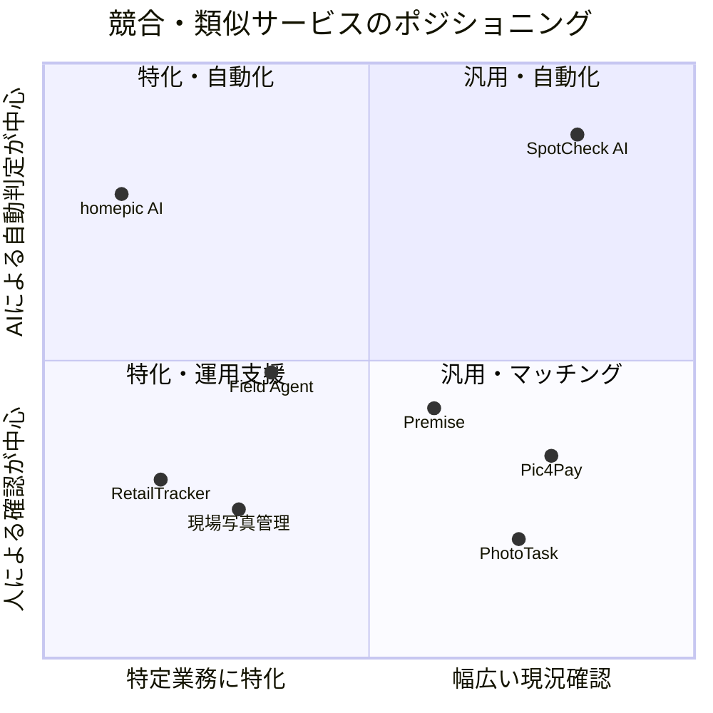

# SpotCheck AI 競合調査・比較案

調査日：2026年8月14日

## 調査の前提

SpotCheckと完全に同じ機能を持つサービスだけでなく、ユーザーが同じ課題を解決するときに比較候補となるサービスを調査した。

競合は、大きく次の3種類に分けられる。

1. **現地写真の依頼・撮影マッチング**：任意の場所の写真を近隣ユーザーへ依頼する
2. **店舗・売場のクラウド調査**：多数の調査員を使い、棚や広告の状態を収集する
3. **業務用の現場写真管理・点検**：自社スタッフが撮影した写真と位置情報を管理する

比較表の「公開情報で確認できず」は、その機能が存在しないことを断定するものではない。各サービスの公式サイト上で明示的に確認できなかったことを表す。

## 主要な競合・類似サービス

### 直接競合：現地写真の撮影マッチング

#### Pic4Pay

任意の場所を指定して写真を依頼し、近隣の撮影者からGPS情報付きの写真を受け取るサービス。物件確認、店舗外観、工事進捗、保険用記録など、SpotCheck AIと近い用途を掲げている。依頼者が予算と期限を設定し、撮影者の入札から選ぶ方式である。

- 類似点：地点指定、報酬設定、近隣撮影者とのマッチング、GPS付き写真
- 主な違い：公開情報では、AIによる依頼審査、提出画像の自動合否判定、自動再撮影指示、個人情報の自動マスキングまでは確認できない
- 公式サイト：[Pic4Pay — Get photos of any location, on demand](https://pic4pay.com/)

#### PhotoTask

地図上で撮影場所とカテゴリを指定し、近くのユーザーが依頼を受けて写真をアップロードするiOS・Androidアプリ。個人間で使えるシンプルな現地写真リクエストに重点を置いている。

- 類似点：地点指定、近隣ユーザーへの依頼、スマートフォンでの撮影と納品
- 主な違い：公開情報では、報酬・AI検品・位置偽装対策・プライバシーマスキングの詳細は確認できない
- 公式サイト：[PhotoTask — Photo Requests Made Easy](https://phototaskapp.com/)

### 隣接競合：店舗・売場のクラウド調査

#### Field Agent

一般ユーザーのスマートフォンを活用して、店舗の棚、価格、在庫、販促物などを調査する企業向けサービス。大規模な調査員ネットワークと、ダッシュボードによる分析が強みである。公式情報では、提出データを担当チームが品質確認する運用も説明されている。

- 類似点：現地ユーザーへの有償タスク、写真収集、店舗・広告監査
- 主な違い：小売・ブランド向けの定型調査と大規模分析に強い。SpotCheck AIは、個別地点・自由記述の依頼を作成でき、審査から納品までの自動化を狙う
- 公式サイト：[Field Agent — Audits](https://gb.fieldagent.net/audits/)、[Field Agentについて](https://www.fieldagent.net/about)

#### RetailTracker

全国のアプリユーザーが店舗の商品棚を撮影し、棚写真と構造化データを企業へ納品するラウンダー調査サービス。棚撮影に用途を絞り、大量店舗の販促物や陳列状況を確認することに強みがある。公式サイトでは、AI画像解析は拡張として検討中と説明されている。

- 類似点：クラウドワーカーによる現地撮影、店舗や広告の状態確認、写真納品
- 主な違い：店舗棚調査に特化している。SpotCheck AIは、不動産、工事、屋外広告などを含む汎用的な依頼を想定し、VLMによる条件適合判定を組み込む
- 公式サイト：[RetailTracker](https://mkt-apps.com/rounder/)

#### Premise

世界各地のコントリビューターへ情報収集タスクを配信するクラウドソーシング型のデータ収集サービス。写真、位置、バーコード、テキスト、評価、タイムスタンプなどを収集でき、店舗調査だけでなく公共・非営利分野にも利用されている。

- 類似点：位置にひもづくマイクロタスク、スマートフォンでの写真収集、報酬
- 主な違い：企業・組織向けの大規模な現地データ収集基盤である。SpotCheck AIは、一件の依頼作成から受注、AI検品、プライバシー処理、逐次納品までを一つのUIで完結させる
- 公式情報：[Premiseの仕組み](https://premise.com/es/blog/understanding-premises-role-in-ukraine/)、[Contributorアプリ](https://premise.com/es/blog/the-new-and-improved-premise-app-launches/)

### 代替手段：現場写真管理・AI点検

#### 現場写真情報管理システム

自社の現場担当者がスマートフォンやタブレットで施設・設備を撮影し、日時、コメント、位置座標をサーバーへ送る業務用クラウドサービス。管理者は遠隔から最新状況と撮影位置を確認できる。

- 類似点：現場写真、位置情報、遠隔からの状況確認
- 主な違い：撮影者を外部から探すマーケットプレイスではなく、組織内の現場業務を管理するツール。AIによる依頼審査や画像の自動合否判定は公開情報で確認できない
- 公式サイト：[現場写真情報管理システム](https://www.softplanet.co.jp/soft/genba-photo.php)

#### homepic AI

入居時・退去時などの住宅状態を撮影し、AIが傷、カビ、ひび、汚れなどを検出する点検アプリ。GPSとサーバー時刻を保存し、以前の写真との比較やレポート作成にも対応する。

- 類似点：AI画像検査、GPS、サーバー時刻、撮り直しを支援する撮影ガイド
- 主な違い：住宅の状態記録に特化し、利用者自身が撮影する。依頼者と現地ワーカーのマッチングや、自由な撮影条件に対するVLM検品は目的としていない
- 公式ストア：[homepic AI — Google Play](https://play.google.com/store/apps/details?id=kr.co.hajapp)

## 機能比較

| サービス | 主な用途 | 撮影者マッチング | 任意地点・自由依頼 | 位置情報の検証 | AIによる提出画像検品 | 自動再撮影指示 | 個人情報マスキング | 主な強み |
|---|---|:---:|:---:|:---:|:---:|:---:|:---:|---|
| **SpotCheck AI** | 汎用的な遠隔現況確認 | ○ | ○ | ○ | ○ | ○ | ○ | 依頼審査から安全な納品までをAIで一気通貫に自動化 |
| Pic4Pay | 物件・店舗・工事などの現地写真 | ○ | ○ | ○（GPS付き写真） | 公開情報で確認できず | 公開情報で確認できず | 公開情報で確認できず | SpotCheck AIに最も近い汎用写真マーケットプレイス |
| PhotoTask | 個人向けの現地写真依頼 | ○ | ○ | 公開情報で確認できず | 公開情報で確認できず | 公開情報で確認できず | 公開情報で確認できず | シンプルな個人間写真リクエスト |
| Field Agent | 店舗監査・市場調査 | ○ | △（企業が設計する調査） | 位置特定型の調査 | △（AI分析あり、品質確認は人も担当） | 公開情報で確認できず | 公開情報で確認できず | 大規模な調査員網と小売分析 |
| RetailTracker | 商品棚・販促物の調査 | ○ | △（棚撮影に特化） | 公開情報で確認できず | △（AI解析は拡張検討） | 公開情報で確認できず | 公開情報で確認できず | 国内の多数ユーザーによる売場可視化 |
| Premise | グローバルな現地データ収集 | ○ | △（運営側がタスクを配信） | ○（位置・時刻を収集） | 公開情報で確認できず | 公開情報で確認できず | 公開情報で確認できず | 広い地域と多様なデータ形式への対応 |
| 現場写真情報管理システム | 施設・設備の現場管理 | × | △（自社業務内） | ○ | 公開情報で確認できず | × | 公開情報で確認できず | 既存スタッフの現場写真を一元管理 |
| homepic AI | 住宅の入退去・状態点検 | × | ×（住宅に特化） | ○ | ○ | △（撮影ガイド） | 公開情報で確認できず | 住宅の不具合検出と時系列比較 |

### 記号

- `○`：公式情報で対応を確認できる
- `△`：一部対応、またはSpotCheck AIとは異なる方式で対応する
- `×`：サービスの目的・仕組み上、対象外と判断できる
- `公開情報で確認できず`：非対応とは断定せず、公式公開情報で確認できなかったもの

## ポジショニング

上図は各社の公開情報をもとにした定性的な整理であり、性能測定や市場シェアを示すものではない。

## SpotCheck AIの差別化ポイント

### 1. 撮影マッチングとAI検品を一つにしたこと

Pic4PayやPhotoTaskは「離れた場所の写真を近くの人に撮ってもらう」という課題を直接解決する。一方、AI点検製品は、撮影後の解析に強い。SpotCheck AIはこの二つを接続し、**誰に撮ってもらうかだけでなく、届いた写真を納品してよいかまで自動で判断する**ことを狙っている。

### 2. 自由記述の依頼をAIが実行可能な条件へ変換すること

店舗棚や住宅点検に特化したサービスは、あらかじめ決められた撮影項目を高い精度で扱える。SpotCheck AIでは用途を固定せず、依頼文から撮影対象、構図、時間帯などの条件を読み取り、不足があれば公開前に補足を求める。

### 3. 再撮影まで自動でループさせること

単にAIスコアを表示するだけでは、依頼者が不合格理由を読み、ワーカーへ連絡する作業が残る。SpotCheck AIは不合格理由を「暗すぎる」「対象が小さい」「指定対象が写っていない」などの具体的な撮影指示へ変換し、ワーカーの画面へ返す。

### 4. プライバシー保護を納品前の必須工程にしたこと

屋外や店舗周辺の撮影では、通行人、車のナンバー、表札などが偶然写り込む。SpotCheck AIはそれを撮影失敗として扱うのではなく、条件適合の検品後にマスキングし、加工済み画像だけを依頼者へ渡す。

### 5. AIの不確実性を前提にしたこと

AIによる完全自動化そのものだけでなく、決定論フィルター、境界スコアでの追加判定、Pydanticによる出力検証、位置・時刻の複合チェック、スタブへのフォールバックを組み合わせている。これは、AIの一回の回答をそのまま業務判断に使わないための設計である。

## Zenn記事に載せる短縮版

以下は、そのまま記事の「競合サービスとの違い」へ転記できる短縮版である。

### 競合サービスとの違い

現地写真を扱うサービスには、近隣ユーザーへ撮影を依頼できるPic4PayやPhotoTask、店舗調査に特化したField AgentやRetailTracker、住宅のAI点検を行うhomepic AIなどがあります。

| 分類 | 代表例 | 得意なこと | SpotCheck AIとの違い |
|---|---|---|---|
| 現地写真マッチング | Pic4Pay / PhotoTask | 任意地点の写真を近隣ユーザーへ依頼 | SpotCheck AIは提出後のAI検品、再撮影指示、マスキングまでを一つのフローに含む |
| 店舗クラウド調査 | Field Agent / RetailTracker | 多数店舗の棚・価格・販促状況を定型調査 | SpotCheck AIは業種を限定せず、一件単位の自由な撮影依頼を扱う |
| グローバルデータ収集 | Premise | 世界各地で写真・位置・調査データを収集 | SpotCheck AIは依頼者とワーカー双方のUIと、個別依頼の逐次納品に重点を置く |
| AI点検 | homepic AI | 住宅写真から傷やカビなどを検出 | SpotCheck AIは撮影者のマッチングと、依頼ごとに異なる条件のVLM検品を行う |
| 現場写真管理 | 現場写真情報管理システム | 自社スタッフの写真・日時・位置を管理 | SpotCheck AIは外部ワーカーを募り、提出物を自動判定する |

SpotCheck AIの独自性は、一つひとつの技術が新しいことだけではありません。**現地の人を探すマーケットプレイスと、依頼審査・画像検品・再撮影・プライバシー保護を行うAIパイプラインを、一つのサービスとして接続した点**にあります。

:::message
比較内容は2026年8月14日時点の各社公開情報に基づきます。「公開情報で確認できず」は、当該機能が存在しないことを断定するものではありません。
:::

## 表現上の注意

Zenn記事では、次のような断定は避ける。

- 「競合にはAIがない」
- 「世界初」「唯一」
- 「完全に位置偽装を防止できる」
- 「人間より正確」

代わりに、次のように公開情報と自分たちの設計へ限定して表現する。

- 「今回確認した公開情報では、自動検品からマスキングまで一気通貫で行うサービスは確認できませんでした」
- 「SpotCheck AIでは、マッチングとAI検品を一つのワークフローとして設計しました」
- 「位置・時刻・画像の複数情報を使い、位置偽装のリスクを下げます」

