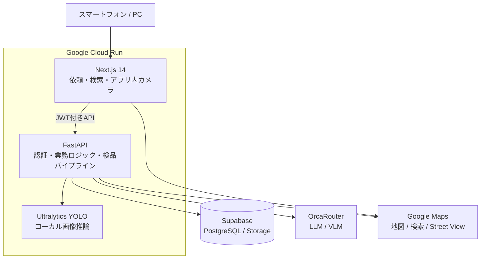
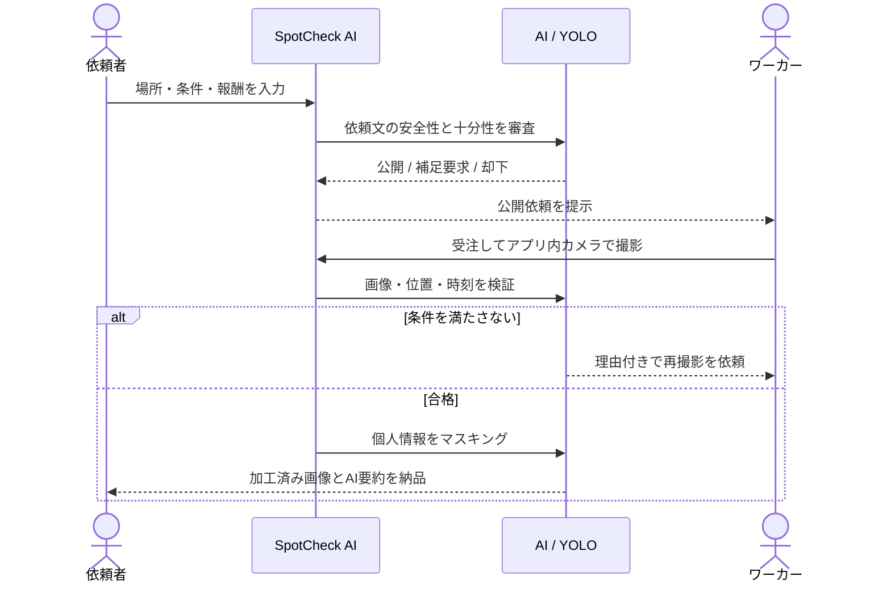

## はじめに

こんにちは！私たちは、9日間でAIプロダクトを開発するハッカソン **[AI HACK 2026](https://aihackathon.jp/)** に参加し、遠隔地の現況確認を依頼したい人と、その場所の近くにいる人をつなぐ **SpotCheck** を開発しました。

「今から行くお店の混雑状況を知りたい」「管理物件や工事現場の現在の様子を確認したい」しかし、このためだけに現地へ向かうのは時間も費用もかかります。

SpotCheckは、現地撮影の依頼・受注・撮影・納品を一つのアプリケーションにまとめ、依頼内容の審査から提出画像の検品、位置情報の確認、プライバシー保護までをAIを利用して自動化しています。

この記事では、開発したプロダクトの概要、ハッカソン期間中の進め方、システム構成、AIを実サービスの判定に組み込むうえで工夫した点を紹介します。

## 1. プロジェクト概要

### SpotCheckとは

SpotCheckは、遠隔地の「今」を知りたい依頼者と、現地で写真を撮影できるワーカーをマッチングするWebアプリケーションです。

たとえば、次のような用途を想定しています。

- 店舗の混雑状況や設備の現況確認
- 災害後の周辺状況など、離れた場所の調査
- 工事現場の進捗確認

本プロダクトの特徴は、単に写真を受け渡すだけではなく、**人による目視検品を前提としないワークフロー**を設計したことです。

AIと画像認識が、以下の処理を一貫して担当します。

1. 依頼文の意図と安全性
2. 撮影対象・場所・条件が十分に書かれているか
3. 提出された画像が依頼条件を満たすか
4. 顔、ナンバープレートなどのマスキング

### 解決したい課題

検索エンジンや地図サービス、生成AIを使えば、場所に関する多くの情報を得られます。しかし、そこで参照されるのは過去に公開されたWebページ、口コミ、投稿、撮影済みの画像などです。そのため、次のような**特定の場所の今**を知りたい場面には十分に対応できません。

- 今、店舗の前にどれくらいの行列ができているか
- 掲載されている営業時間どおりに営業しているか
- 工事や設備の状態が現在どうなっているか
- 現地の天候や混雑など、訪問前に知りたい状況がどうなっているか

確実に知るには自分で現地へ行く必要がありますが、遠方の場合や、確認だけのために移動する場合には時間と費用がかかります。ライブカメラなどが設置されている場所もありますが、確認できる地点や画角は限られます。

そこで私たちは、**その場所の近くにいる人へ必要な写真の撮影を依頼し、検索や生成AIだけでは取得できないリアルタイムな情報を受け取れる仕組み**を目指しました。さらに、依頼内容の審査や提出画像の確認をAIで支援することで、依頼者と撮影者の双方が安心して利用できるようにしています。

### 対象ユーザー

SpotCheckは、主に次のような人を対象としています。

**撮影を依頼する人**

- 飲食店やイベント会場へ行く前に、現在の混雑状況を知りたい人
- 旅行先や遠方の施設について、検索では分からない現地の様子を確認したい人
- 離れた場所にある店舗、物件、設備などの現在の状態を確認したい人
- 現地へ行くほどではないものの、特定の場所の最新情報が必要な人

**撮影する人**

- 通勤、通学、買い物などの移動中に、近くの撮影依頼へ協力したい人
- 空き時間を使い、短時間の撮影タスクで報酬を得たい人

特定の業界だけに限定せず、**「その場所の今を知りたい人」と「今その場所の近くにいる人」**をつなぐことを想定しています。

## 2. 使い方

### 依頼者側

依頼者は、確認したい地点、撮影条件、時間帯、報酬、必要な撮影人数を入力します。依頼を送信すると、AIが安全性と情報の十分性を審査します。

条件が曖昧な場合はそのまま公開せず、不足している情報を提示します。犯罪目的や撮影禁止場所など、危険性のある依頼はこの時点で拒否されます。

<!-- TODO: 依頼作成画面とAI審査結果のスクリーンショットを挿入 -->

### ワーカー側

ワーカーは地図や一覧から近くの依頼を探して受注します。撮影にはアプリ内カメラを使用し、画像・現在地・撮影時刻を同じリクエストで送信します。

提出後はAIが画像を検品し被写体が小さい、指定された対象が写っていない、といった問題があれば具体的な再撮影指示を返します。再撮影は最大2回まで行えます。

<!-- TODO: 依頼一覧、撮影画面、再撮影指示のスクリーンショットを挿入 -->

### 納品

合格した画像には、顔やナンバープレートなどのマスキング処理を行います。依頼者に届くのは加工済み画像のみです。

複数人へ依頼した場合も、全員の撮影完了を待つ必要はありません。合格したワーカーの分から逐次納品し、報酬を確定します。

<!-- TODO: AI検品スコアとマスキング済み納品画像のスクリーンショットを挿入 -->

## 3. システムアーキテクチャ

### 技術スタック

| レイヤー | 使用技術 |
|---|---|
| フロントエンド | Next.js 14 / TypeScript / Tailwind CSS |
| バックエンド | Python / FastAPI / Pydantic / SQLAlchemy / Alembic |
| DB・ストレージ | Supabase（PostgreSQL / Storage） |
| LLM・VLM | OrcaRouter経由のモデルルーティング |
| 物体検出・画像処理 | Ultralytics YOLO / Pillow / OpenCV |
| 地図 | Google Maps JavaScript API / Street View |
| インフラ | Google Cloud Run / GitHub Actions |

### OrcaRouterの活用

本プロダクトのLLM・VLM呼び出しには、AI HACK 2026の協賛サービスである **[OrcaRouter](https://www.orcarouter.ai/)** を使用しました。OrcaRouterは、複数のAIモデルを一つのAPIから利用できるAIゲートウェイです。

SpotCheckでは、依頼文の審査、提出画像の検品、マスキング対象の検出補完、文章生成にOrcaRouterを利用しています。AIの呼び出しをバックエンドの `OrcaClient` に集約し、用途ごとに使用するモデルを切り替えられるようにしました。これにより、モデルを変更する場合も、依頼や検品などの業務ロジックを書き換えずに対応できます。

また、重要な判定を一つのモデルだけに委ねないため、OrcaRouterを通じて複数モデルへ判定を依頼できる構成にしています。通常は一度の判定結果を使用し、検品において合否ライン付近の画像は追加判定を行うことで、精度、応答時間、推論コストのバランスを取りました。

### 依頼から納品までの処理

## 4. AI判定において工夫したこと

### AIだけに安全性を任せない

依頼内容をAIで審査する前に、まずルールベースのフィルターを通します。たとえば、犯罪につながる内容や撮影禁止場所など、明確に許可できない依頼をキーワードとルールによって検出しこの段階で拒否するようにします。

そのうえで、単純なキーワードだけでは判断できない依頼をAIへ渡し、文章の文脈や目的、撮影条件の妥当性を審査します。**明確な禁止事項はルールベースで判定し、文脈を読む必要がある部分はAIで判定する**形となっています。

### 重要な判定は多数決にする

同じ画像とプロンプトを入力しても、モデルの判定スコアが合否の境界をまたぐことがありました。そこで、誤判定の影響が大きい依頼審査や画像検品では、複数モデルによる判定を組み合わせられる設計にしました。

ただし、すべての画像を常に複数回判定すると、待ち時間と推論コストが増えます。そのため、画像検品ではスコアが合否ライン付近の場合のみ追加判定を行います。

### プライバシー保護を納品フローに組み込む

検品とプライバシー処理を分離し、撮影条件を満たしていれば、その後に次の対象をマスキングする形をとっています。

- 顔・人物
- 車両のナンバープレート
- 表札、部屋番号
- 個人情報が記載された書類や伝票

YOLOによるローカル推論とVLMによる補完を組み合わせ、検出漏れを減らします。依頼者へ配信するURLも期限付きの署名URLとしています。

## 5. ハッカソンでの開発

### デモを先に成立させる

短期間でAI機能をすべて作り込もうとすると、最後まで一連の操作を確認できないリスクがあります。そこで開発を段階に分け、最初にスタブを使って「依頼作成 → 受注 → 撮影 → 検品 → 納品」の画面フローを完成させました。

その後、以下の順で実処理へ置き換えました。

1. DBとCRUD API、認証を実装
2. 主要画面をつなぎ一気通貫のデモを成立
3. 依頼文のAI審査を追加
4. VLMによる画像検品と位置偽装対策を追加
5. YOLOとVLMによるマスキングを追加
6. Cloud Runへのデプロイ、期限処理、エラー処理を整備

この進め方により、外部AI APIに問題が起きてもアプリ全体の開発を止めず、各段階で動作を確認できました。

## 6. 現時点の制約と今後の展望

現時点では、決済機能はUIとデータ記録のみのスタブです。また、GPS情報だけで高度な位置偽装を完全に防ぐことはできず、AIによる画像判定にも誤判定の可能性があります。

今後は、次の改善に取り組みたいと考えています。

- 実決済と報酬支払いの実装
- 実データを用いた検品モデルと閾値の継続的な評価
- AI判定への異議申し立てや人による例外対応フロー
- 通知、検索、評価機能の改善によるマッチング精度向上

## おわりに

SpotCheckは、遠隔地の状況確認に伴う移動・調整・検品のコストを、現地の人とAIの組み合わせで解決するプロダクトです。

今回のハッカソンでは、生成AIを会話や文章生成だけに使うのではなく、依頼の安全性確認、画像の合否判定、再撮影のフィードバック、プライバシー保護という一連の業務フローへ組み込みました。同時に、ルール、多数決、スキーマ検証、フォールバックを重ねることで、AIの不確実性をカバーしました。

遠く離れた場所の「今を見たい」と思ったとき、誰もが必要な情報へ安全にアクセスできる。SpotCheckを、そのためのインフラへ育てていきたいと考えています。

## 各種リンク

- デモ動画：
- デモ環境：https://spotcheck-frontend-dathtekrwq-an.a.run.app/home
- GitHub：https://github.com/Syooosuke/AI-HACK-2026

## チーム名

